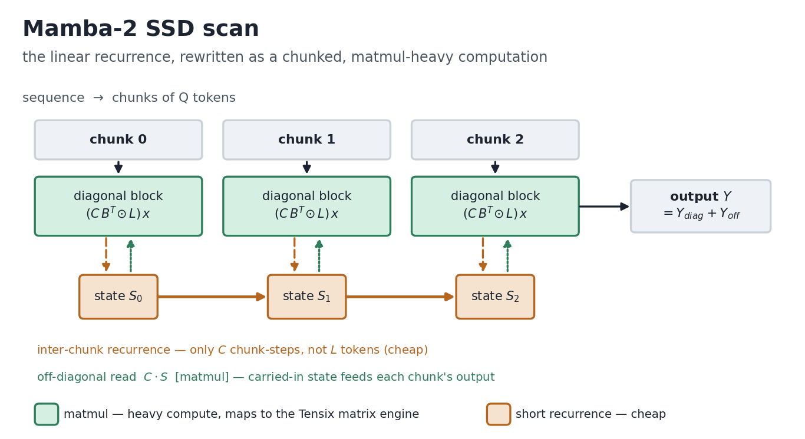
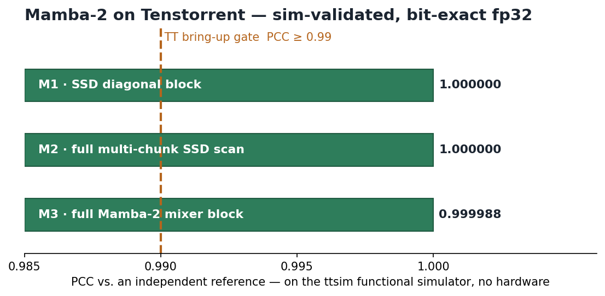

# Mamba-2 (SSD) on Tenstorrent

Bringing up the Mamba-2 State-Space-Duality layer on Blackhole, validated on the `ttsim` functional
simulator against a plain PyTorch/NumPy reference. No hardware needed for any of this yet.

## Why bother — isn't Mamba-1 already there?
It is (`models/demos/wormhole/mamba`), but Mamba-1's selective scan is a sequential associative scan, so it's
memory-bandwidth-bound and doesn't lean on what the Tensix cores are actually good at. Mamba-2 is the
interesting one: its SSD formulation rewrites the exact same linear recurrence as a chunked, matmul-heavy
computation (a decay-masked attention within each chunk, plus a short recurrence across chunk states). That's
a much better fit for the matrix engine. And the SSD chunk kernel isn't Mamba-specific — it's the shared
substrate under the whole 2025-26 hybrid-SSM crowd (Falcon-H1, Granite-4-H, Codestral-Mamba…), none of which
run on TT today. So it felt like the right place to start.

The math and how each piece maps onto Tensix ops is in `design/SSD_MATH_AND_TT_MAPPING.md`.

## Where it's at
Everything below is on the simulator (bit-exact fp32), checked against an independent reference at TT's usual
bring-up bar of PCC ≥ 0.99:

- [x] SSD chunked scan (diagonal blocks + inter-chunk recurrence + off-diagonal reads) — matches a plain O(L)
      recurrence to ~1e-16 (fp64), and runs as a real ttnn op-graph on the sim at **PCC 1.0**
- [x] Full Mamba-2 mixer block (in_proj + per-head SSD + gated RMSNorm + out_proj) on the sim at **PCC 0.9999**
- [ ] Move the causal conv1d + softplus on-device (they're on the host in this pass, so the PCC above covers
      the matmul/scan/norm path, not those two ops yet)
- [ ] Wire it into a real model dir + load `state-spaces/mamba2-*` weights
- [ ] On-device forward + throughput — the part I can't do without a card

I don't have Blackhole hardware, so the on-silicon forward and any perf numbers are the missing piece.

## Layout
- `design/` — the SSD derivation, the chunked algorithm, and the op-by-op Tensix mapping
- `ssd_ref/` — the NumPy oracle (`ssd_minimal.py`) plus a consistency sweep across shapes/decay ranges
- `ttnn_impl/` · `validation/` — the ttnn op-graph and the sim harness that produces the PCC numbers above

## Run the reference yourself (no hardware, no TT install)
`cd ssd_ref && python3 ssd_minimal.py` prints the chunked-vs-naive agreement, and
`python3 test_ssd_consistency.py` sweeps it. The ttnn/ttsim validation runs inside the tt-metal release image
with `libttsim`; notes in `validation/`.
